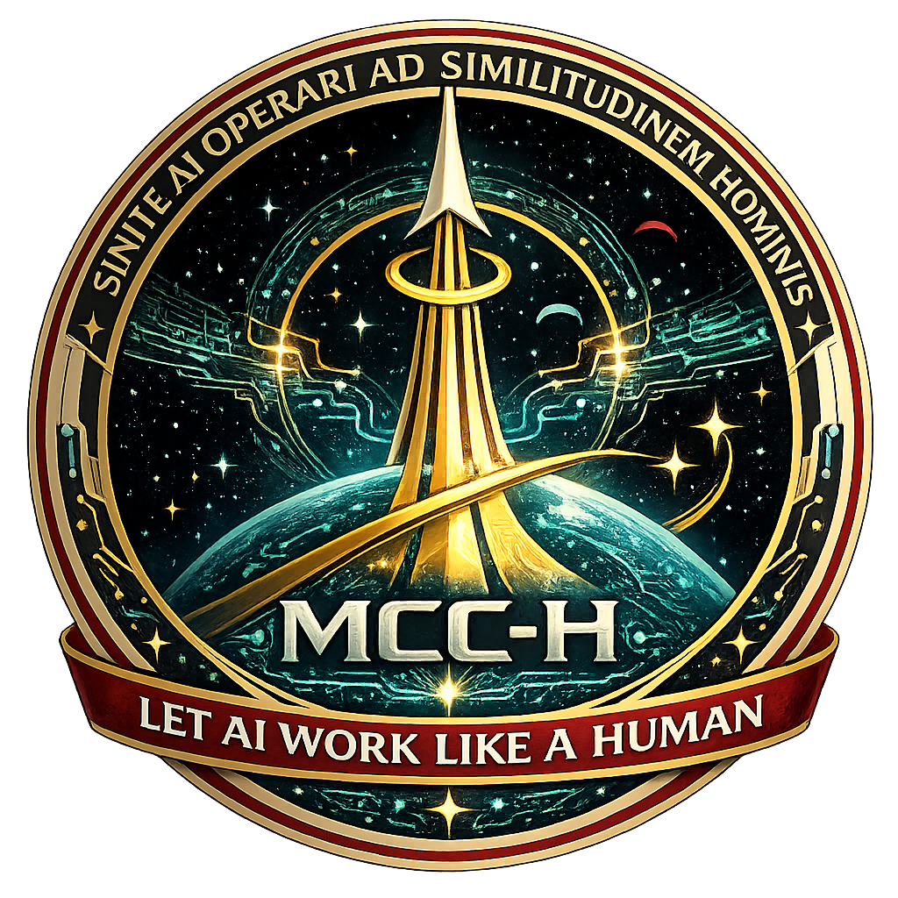
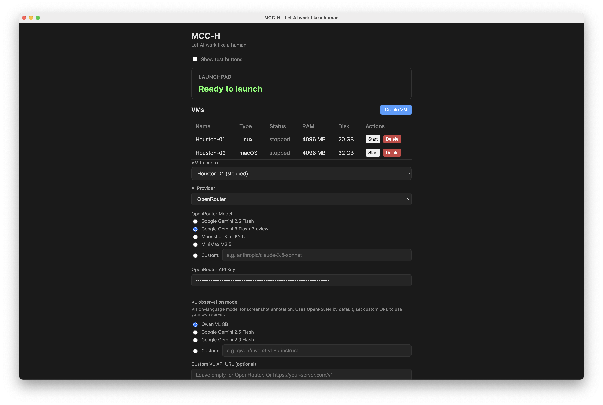
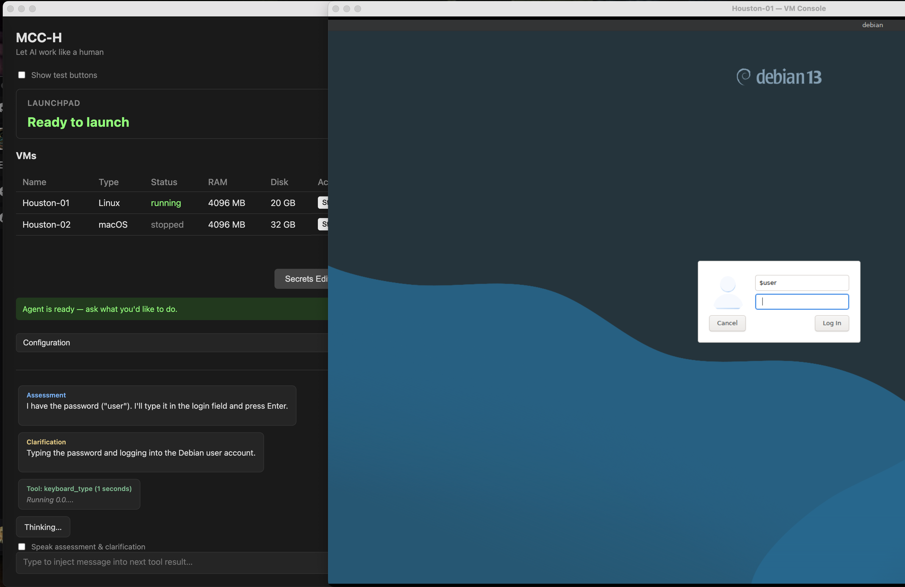
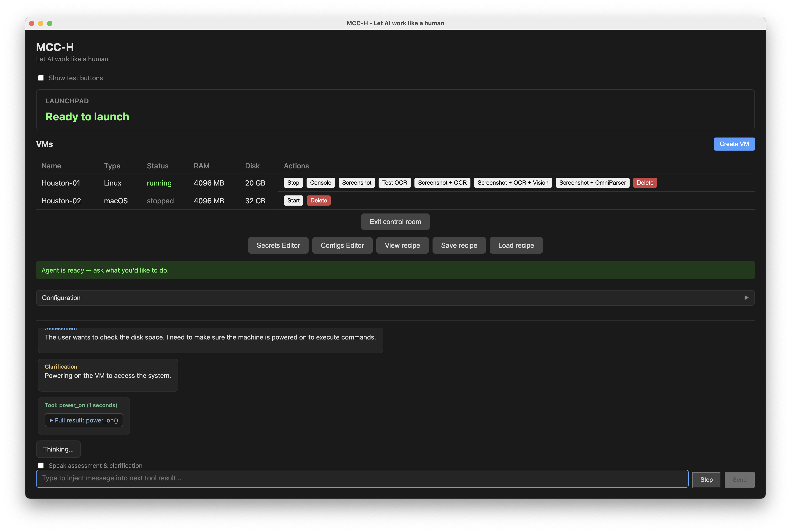
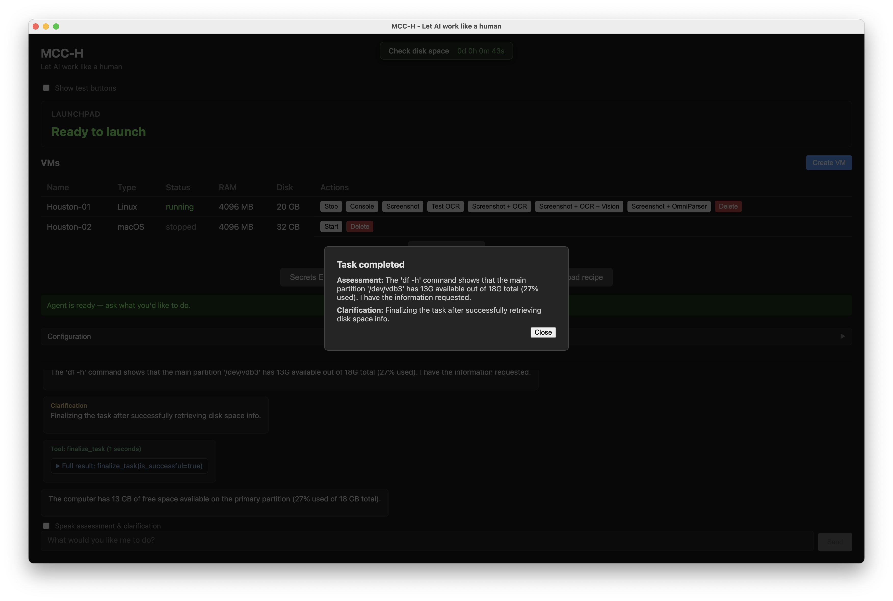

# Houston

<p align="center">
  
</p>

**Let AI work like a human.**

<p align="center">
  <br>
  <br>
  <br>
  
</p>

**Pre-alpha** — A universal GUI-only AI agent that controls virtual machines and desktops like a human: screenshots, mouse, keyboard, SSH. Capable of any actions, including OS installs, app configuration, and full desktop automation.

> **Warning:** This is pre-alpha software. The agent can perform any action you request. Use with caution and supervise sensitive operations.

**Current mode:** One-user only. Only one VM and one chat can be active at the same time.

**Discord:** [Join our community](https://discord.gg/nHAD8Ptv)

---

## Vision

Houston is an experiment in **flipping sides**: instead of building new interfaces for AI, we let AI use ours — the same screens, mice, and keyboards humans use. The agent sees what we see and acts as we do. The aim is a path toward real AGI that operates in the real world.

**Goal:** Build a universal GUI-only agent that acts like a human — sees the screen, clicks, types, and navigates interfaces. In the future, the vision extends toward **singularity**: the agent configuring its own employees and setting up computers by itself.

---

## Concepts

### Common Memory (Agent Without Memory)

Houston uses a **stateless agent** model: no persistent memory between sessions. Each task starts fresh. Knowledge is encoded in **recipes** — reusable, shareable, verifiable task flows — not in agent state.

### Tasks and Recipes

- **Tasks** are one-off executions: the agent receives a goal, takes screenshots, acts via mouse/keyboard/SSH, and completes or fails.
- **Recipes** are recorded task flows: a sequence of tool calls (snapshots, clicks, typing, SSH commands) with assessments and screenshots. Recipes can be:
  - **Generated** by the agent during execution
  - **Verified** or **edited** by humans
  - **Signed with PGP keys** (planned, similar to Debian packages) for trust and provenance

Recipes are exportable as HTML + screenshots (ZIP) for sharing and auditing.

### Human-like interaction

The agent follows a human-like loop until the task is done:

1. **Assessment of history** — What happened so far? What does the last result mean?
2. **Clarification of action** — Why am I doing this next step? What outcome do I expect?
3. **Action** — Execute (click, type, SSH, etc.).
4. **Observation of changes** — What changed on screen? Did it match expectations?
5. Repeat until done.

Every tool call carries `assessment` and `clarification` so the agent reasons explicitly at each step.

**2-step observation and action.** The agent first observes (what changed on screen), then decides (where to click, what to type). It receives a **fixed features mask** — interactive elements with known coordinates: checkboxes, radio buttons, text regions, icons. Just like a human: you see what changed, then you think where to click or what to type. The mask is the structured input; reasoning follows.

### Think-as-human-thinks

If we only talk, we only plan — nothing happens. **Only actions have value** and drive toward a result. The agent is designed to act, not just reason. Planning is cheap; execution is what matters. The loop is: observe → decide → act → observe.

### Observe, don't poll

Instead of polling, the agent **observes changes** in a selected domain (visual or audio). Act only when something changes, unless a schedule says otherwise. (Audio observation is planned; haptic/sensitive input is not available yet.) This is a work in progress — event-driven proactivity builds on this idea.

---

## Architecture

```
┌─────────────────────────────────────────────────────────────────┐
│  Houston (Electron)                                              │
│  ├── Vue UI (chat, VM config, recipe view)                       │
│  ├── MCP Server (tools: take_snapshot, mouse_click, etc.)       │
│  ├── AI Agent (Claude / OpenRouter / ChatGPT)                   │
│  └── Recipe Store (in-memory → export to ZIP)                   │
└─────────────────────────────────────────────────────────────────┘
         │                                    │
         │ HTTP (ai.port)                     │ HTTP (vm.port)
         ▼                                    ▼
┌─────────────────────────────┐    ┌─────────────────────────────────┐
│  HoustonAI (Swift, macOS)    │    │  HoustonVM (Swift, macOS)       │
│  ├── OCR pipeline           │    │  ├── VM management               │
│  ├── Vision models          │    │  │   (Apple Virtualization)      │
│  │   (Apple Vision,         │    │  ├── Screenshot capture         │
│  │    YOLOv8, CoreML)        │    │  │   (IOSurface)                 │
│  └── /ocr, /captions,       │    │  └── Input injection            │
│      /ocr-omni-parser       │    │      (mouse, keyboard)           │
└─────────────────────────────┘    └─────────────────────────────────┘
                                               │
                                               ▼
                                    ┌─────────────────────────────────┐
                                    │  Guest VM (Linux / macOS)       │
                                    │  └── Desktop or TUI to control  │
                                    └─────────────────────────────────┘
```

- **Electron** app: Vue frontend, MCP server exposing tools, AI agent (Claude/OpenRouter/ChatGPT). Starts HoustonAI on launch.
- **HoustonAI** (Swift): Separate process exposing HTTP endpoints for OCR, captions, and vision models. Runs Apple Vision, YOLOv8 (checkbox, web form, UI elements), OmniParser. Port written to `~/.houston/ai.port`.
- **HoustonVM** (Swift): VM lifecycle, screenshot capture, input injection. Port written to `~/.houston/vm.port`.
- **Guest VM**: Linux (Debian) or macOS, controlled via screenshot + mouse/keyboard or SSH.

---

## Sample prompts

Example prompts you can give the agent. More recipes are available at [mcc-h.ai](https://mcc-h.ai).

### Debian installation

```
I want you to install debian operating system in graphical mode, creating user named "user" with password "user", root with password "root". Use Tallinn time zone and xfce desktop environment, but keep US keyboard layout.

After installing system, save login credentials for further use, if they aren't saved yet.

Then get computer ip address via "ip a" and save it for further use, if it aren't saved yet.

Then login to computer via ssh user, add user "user" to sudoers with usage of "su" command to authorize yourself as root (get root credentials if required), so he can execute commands without asking password. Then install openssh-server and chromium browser. Set chromium browser as default one.

Make every window open maximized by default.
```

### macOS installation

```
I want you to install macos without apple id, user "user", password "password", save this credentials.

Do not enable location services.

After installation:

enable remote access (login) (ssh server), then get IP address of computer and save it to configuration. Then test ssh connection.
```

---

## OCR and Vision Tools

On-device (HoustonAI, Apple Silicon):

| Tool | Model | Purpose |
|------|-------|---------|
| **OCR** | Apple Vision | Text recognition with coordinates |
| **CheckboxDetector** | YOLOv8 (LynnHaDo) | Checkbox state (checked/unchecked) |
| **WebFormDetector** | YOLOv8 (foduucom) | Web form fields (button, input, dropdown, checkbox, radio button, etc.) |
| **OmniParserDetector** | OmniParser-v2.0 (Microsoft) | Cross-platform desktop icons |
| **UIElementsDetector** | YOLOv11 (MacPaw Screen2AX) | macOS accessibility-style elements |
| **IconCaptionDetector** | qwen3-vl-2b (LM Studio) | Icon captioning via local VL model |

Cloud (optional):

- **Qwen VL** (OpenRouter): Full screenshot annotation and change detection.

All CoreML models use `cpuAndNeuralEngine` for Apple ARM optimization.

---

## Apple ARM Optimization

- **CoreML** with `computeUnits: .cpuAndNeuralEngine` — runs on Apple Neural Engine when available.
- **arm64-only** build for macOS (see `electron-builder.json5`).
- **Model preloading** at startup to avoid latency on first snapshot.
- **Sharp** (darwin-arm64) for image processing in the Electron layer.

---

## `~/houston` Storage Structure

All Houston data lives under `~/houston`:

```
~/houston/
├── config.json          # App config (VM ID, AI provider, API keys, models)
├── usage.json           # Token usage and cost tracking
├── agent-config.json    # Agent config entries (key-value)
├── secrets.json         # Agent secrets (credentials, API keys)
├── chatgpt-oauth.json   # ChatGPT OAuth tokens (if used)
├── chromiumData/        # Electron userData (caches, etc.)
├── VMs/                 # Virtual machine disk images and metadata
└── ISOs/                # Installation media (e.g. debian-13.3.0-arm64-netinst.iso)
```

---

## Security

Due to pre-alpha status, **secrets are stored in plaintext** in `~/houston/secrets.json` and may be **included in recipes** (exported task flows). Do not store sensitive credentials you would not want exposed. This will be addressed in a future release (encryption, redaction in recipes, etc.).

---

## Build and Run

**Hardware:** Apple Silicon Mac only. At least 16 GB RAM. ~40 GB free disk space (for models and VMs).

**Prerequisites:** Node.js, Swift 5.9+, Xcode (macOS).

### Quick start: `launch.sh`

From the project root, a single script builds and runs Houston:

```bash
./launch.sh
```

This runs: `npm install` → `swift build` (HoustonVM, HoustonAI) → `npm run electron:build` → `npx electron .`

### Packaging: `build.sh`

To build a signed DMG for distribution (Apple ARM64 only):

```bash
./build.sh
```

This runs: `npm install` → `electron-vite build` → HoustonVM (release) → HoustonAI (release) → copy resources → download llama-cpp → `electron-builder --mac --arm64` with code signing. Output is in `houston/release/`.

**Requirements:** Apple Silicon Mac, Developer ID certificate (F44ZS9HT2P) in keychain for code signing. The script signs the main app and bundled binaries (HoustonVM, HoustonAI, llama-server).

### Notarization: `notarize_and_staple.sh`

After building, notarize the DMG for distribution outside the Mac App Store:

```bash
./notarize_and_staple.sh <apple-id> <app-specific-password>
```

Or with environment variables:

```bash
APPLE_ID="your@email.com" APP_PASSWORD="xxxx-xxxx-xxxx-xxxx" ./notarize_and_staple.sh
```

The script finds the latest DMG in `houston/release/`, submits it to Apple for notarization, waits for completion, and staples the ticket. Create an app-specific password at [appleid.apple.com](https://appleid.apple.com) → Sign-In and Security → App-Specific Passwords.

### Manual build

```bash
cd houston
npm install
npm run electron:dev      # Development
npm run electron:pack     # Build DMG for arm64
```

HoustonVM and HoustonAI must be built separately (or are bundled when using `electron:pack`):

```bash
cd houston/houston-vm
swift build -c release

cd houston/houston-ai
swift build -c release
```

---

## Building Models Yourself

Several OCR/vision models can be built from source. Scripts are included in the repo.

### Icon captioning (`icon-caption/`)

Provides an **alternative icon captioning server** using OmniParser/Florence-2 (instead of LM Studio). Uses the `icon_caption` submodel from `microsoft/OmniParser-v2.0` (~1.1 GB).

**Models:** Florence-2-base (processor), OmniParser-v2.0 icon_caption (Florence 2–based)

**Scripts:**
- `setup_env.sh` — Create conda env `icon-caption`
- `download_model.sh` — Download OmniParser icon_caption from HuggingFace
- `run.sh` — Start Flask server on port 5900 (default)

```bash
cd icon-caption
./setup_env.sh
./download_model.sh
./run.sh
```

The server exposes `POST /captions` with `{"images": ["base64..."]}` and returns `{"captions": ["..."]}`. HoustonAI's built-in caption support uses LM Studio (qwen3-vl-2b) by default; the icon-caption server is an optional alternative.

### Web form detection (`web-form-ui-field-detection/`)

Builds **WebFormDetector.mlpackage** from `foduucom/web-form-ui-field-detection` (YOLOv8). Detects 39 form field classes: button, input, dropdown, checkbox, radio button, etc.

**Models:** foduucom/web-form-ui-field-detection (YOLOv8)

**Scripts:**
- `setup_env.sh` — Create conda env `web-form-ui-field-detection`
- `download_model.sh` — Download model from HuggingFace
- `export_coreml.sh` — Export to CoreML `.mlpackage` (macOS only; requires `coremltools`)

After export, copy into Houston:

```bash
cd web-form-ui-field-detection
./setup_env.sh
./download_model.sh
./export_coreml.sh       # macOS only
cd ../houston
./copy-webform-model.sh  # Copies to houston-vm/Resources and dist-electron
```

### Pre-built CoreML models

The following are bundled in `houston-vm/Sources/HoustonVM/Resources/` and do not require building:

- **CheckboxDetector** — YOLOv8 (LynnHaDo)
- **OmniParserDetector** — OmniParser-v2.0 icon detection
- **UIElementsDetector** — YOLOv11 (MacPaw Screen2AX)

The `copy-icon-caption.sh` script (in `houston/`) copies assets from a separate `test-clip` project (CLIP + spectrum) if you have that setup.

---

## Community and Contributions

We welcome help in:

1. **Extended testing** — especially with on-device VL models (LM Studio, Ollama, etc.) for icon captioning and vision.
2. **Faster on-device models** — finding and integrating smaller, faster vision/language models for form fields, icons, and OCR.
3. **Form fields and icons recognition** — improving detection accuracy, adding new model backends, or better training data.
4. **Sharing recipes** — creating, verifying, and sharing recipes for common tasks (OS install, app setup, etc.).
5. **General improvements** — bug fixes, UX, documentation, PGP signing for recipes.

---

## Planned Features

- **Event-driven proactivity** — Agent reacts automatically when the screen changes, without waiting for user prompts.
- **Windows as controlled OS** — Support for controlling Windows guests (in addition to Linux and macOS).
- **Recipes store and ecosystem** — Public repository of recipes, discovery, ratings, and community sharing.
- **Audio bridges** — Agent can speak into the computer’s microphone and listen to its audio (e.g. during audio/video calls).

---

## License

See [LICENSE](LICENSE) if present.
